# 🔍 Roomies Integration Audit Report
**Date**: August 7, 2025  
**Auditor**: Integration Audit Agent  
**Project**: Roomies - Household Management Platform  
**Scope**: Backend/Cloud (Node.js/TypeScript) ↔ iOS Frontend (SwiftUI) Integration Analysis

---

## 📋 Executive Summary

The Roomies application demonstrates a **partially integrated** architecture with significant disconnects between the backend and iOS frontend. While both components are well-structured individually, critical integration gaps prevent the system from functioning as a cohesive platform.

### Key Findings
- **Integration Status**: 🔴 **DISCONNECTED** - iOS app operates primarily offline
- **API Coverage**: 🟡 **INCOMPLETE** - NetworkManager exists but is not utilized
- **Real-time Features**: 🔴 **NOT IMPLEMENTED** - Socket.io backend ready, iOS client missing
- **Data Synchronization**: 🔴 **BROKEN** - No active sync between local Core Data and backend
- **Authentication Flow**: 🟡 **PARTIAL** - Local auth works, backend integration incomplete

---

## 🗺️ Integration Audit Checklist

### 1. End-to-End Feature Mapping

#### ✅ Backend Features Ready
- **Authentication System**: JWT-based auth with refresh tokens
- **Household Management**: Complete CRUD with invite codes
- **Task Management**: Full lifecycle with assignments and recurring tasks
- **Gamification**: Points, badges, leaderboards, achievements
- **Reward Store**: Point redemption system
- **Challenge System**: Timed challenges with participants
- **Real-time Updates**: Socket.io WebSocket infrastructure
- **Activity Logging**: Comprehensive activity tracking

#### 🔴 iOS Frontend Integration Status
- **Authentication**: Uses local Core Data only, NetworkManager not connected
- **Household Management**: Local creation only, no backend sync
- **Task Management**: Pure local storage, no API calls
- **Real-time Updates**: No WebSocket client implementation
- **Data Persistence**: Core Data only, no backend synchronization

### 2. API Surface & Data Contracts

#### 🔴 Critical Mismatches

**NetworkManager Issues**:
```swift
// iOS: NetworkManager.swift
private let baseURL = "http://localhost:3000/api"
// Problem: Hardcoded localhost, no environment configuration
```

**Unused API Client**:
- NetworkManager fully implemented but never instantiated in views
- API methods defined but not called from UI components
- Authentication flow bypasses network layer entirely

**Type Mismatches**:
```swift
// iOS defines:
struct APIUser: Codable {
    let id: String  // Backend sends UUID
    let streakDays: Int  // Backend doesn't have this field
}

// Backend sends:
{
    id: "uuid-string",
    streak_days: 0  // Snake case vs camelCase
}
```

### 3. Authentication, Authorization & State Flow

#### 🔴 Complete Disconnect

**iOS Authentication Flow**:
```swift
// AuthenticationManager.swift
func loginUser(email: String, password: String) async throws -> User {
    // Only checks local Core Data
    // NetworkManager.login() never called
}
```

**Backend Expecting**:
```typescript
POST /api/auth/login
{
    "email": "user@example.com",
    "password": "password123"
}
// Returns JWT token
```

**Critical Issues**:
- No JWT token storage or management in iOS
- Session state not synchronized
- User creation happens locally without backend registration
- Password hashing happens client-side (security risk)

### 4. Error Handling & Feedback Consistency

#### 🟡 Partial Implementation

**iOS Error Handling**:
```swift
enum NetworkError: LocalizedError {
    case unauthorized
    // Defined but never thrown as network layer isn't used
}
```

**Backend Error Response**:
```json
{
    "success": false,
    "error": {
        "code": "VALIDATION_ERROR",
        "message": "Detailed error message",
        "details": [...]
    }
}
```

**Issues**:
- Error contracts defined but unused
- No error propagation from backend to UI
- User sees generic "operation failed" messages

### 5. Data Freshness, Sync & Real-Time Integration

#### 🔴 No Synchronization

**Socket.io Backend Ready**:
```typescript
// server.ts
this.io.on('connection', (socket) => {
    socket.on('join-household', (householdId: string) => {
        socket.join(`household:${householdId}`);
    });
});
```

**iOS Missing Implementation**:
- No Socket.io client library
- No WebSocket connection handling
- No real-time update listeners
- No background sync mechanisms

**CloudKit Integration**:
```swift
// CloudSyncManager.swift
private let CLOUD_SYNC_ENABLED = false // Disabled
```
- CloudKit scaffolding present but disabled
- No fallback to backend API when CloudKit unavailable

### 6. Security, Privacy & Permissions

#### 🔴 Critical Security Gaps

**Password Handling**:
```swift
// iOS: Hashing passwords client-side
let hashedPassword = hashPassword(password)
// Storing in Core Data directly
```

**Backend Expecting**:
```typescript
// Backend expects plain password, hashes server-side
const hashedPassword = await bcrypt.hash(password, 12);
```

**Issues**:
- Client-side password hashing breaks backend authentication
- No secure token storage (should use Keychain)
- API endpoints accessible without authentication from iOS

### 7. Testing, Monitoring & Observability

#### 🔴 No Integration Testing

**Evidence**:
- No end-to-end tests found
- No API integration tests
- No mock server for iOS development
- No network request logging or monitoring

**Backend Has**:
- Health check endpoints ready
- Comprehensive error logging
- Performance monitoring hooks

**iOS Missing**:
- No network request debugging
- No API response validation
- No integration test suite

### 8. User Journey & Cross-Layer Experience

#### Journey 1: User Registration
```
iOS Flow:
1. User enters details in CreateHouseholdView ✅
2. Creates User in Core Data ✅
3. Generates local household ✅
4. Never calls backend ❌

Expected Flow:
1. POST /api/auth/register ❌
2. Receive JWT token ❌
3. POST /api/households ❌
4. Store token securely ❌
```

#### Journey 2: Task Creation
```
iOS Flow:
1. User creates task in AddTaskView ✅
2. Saves to Core Data ✅
3. No backend sync ❌

Expected Flow:
1. POST /api/tasks ❌
2. Emit socket event ❌
3. Other users receive update ❌
```

#### Journey 3: Points & Rewards
```
iOS Flow:
1. Local point calculation ✅
2. Updates Core Data ✅
3. No leaderboard sync ❌

Expected Flow:
1. POST /api/tasks/:id/complete ❌
2. GET /api/gamification/leaderboard ❌
3. Real-time leaderboard update ❌
```

---

## 🗺️ End-to-End Journey Maps

### Journey 1: New User Onboarding

```mermaid
graph LR
    A[iOS: User Registration] -->|❌ No API Call| B[Backend: /api/auth/register]
    A -->|✅ Local Only| C[Core Data: User Created]
    B -->|❌ Never Reached| D[JWT Token]
    C -->|❌ No Sync| E[Backend Database]
```


### Journey 2: Task Management Flow

```mermaid
graph LR
    A[iOS: Create Task] -->|❌ No API Call| B[Backend: POST /api/tasks]
    A -->|✅ Local Save| C[Core Data: Task Stored]
    B -->|❌ Not Triggered| D[Socket.io: Broadcast]
    D -->|❌ No Client| E[Other iOS Devices]
```


### Journey 3: Household Collaboration

```mermaid
graph LR
    A[iOS: Join Household] -->|❌ No API| B[Backend: /api/households/join]
    A -->|✅ Local Only| C[Core Data: Membership]
    B -->|❌ Not Called| D[Household Sync]
    D -->|❌ No Implementation| E[Real-time Updates]
```


---

## ⚠️ Critical Integration Gaps

### 1. **NetworkManager Completely Unused**
- **Location**: `roomies-ios/HouseholdApp/Services/NetworkManager.swift`
- **Impact**: All API methods defined but never called
- **Root Cause**: Views directly use Core Data instead of network layer

### 2. **Authentication Flow Broken**
- **Issue**: Local-only authentication, no backend integration
- **Impact**: Users cannot access data across devices
- **Files**: `AuthenticationManager.swift` bypasses `NetworkManager`

### 3. **Real-time Features Missing**
- **Backend**: Socket.io ready and configured
- **iOS**: No Socket.io client implementation
- **Impact**: No live updates, collaborative features broken

### 4. **Data Models Incompatible**
- **Issue**: Core Data models don't match API contracts
- **Example**: `streakDays` vs `streak_days`, date format mismatches
- **Impact**: Even if connected, data wouldn't parse correctly

### 5. **Environment Configuration Missing**
- **Issue**: Hardcoded localhost URL
- **Impact**: Cannot deploy to production
- **Need**: Environment-based configuration system

---

## 📊 Checklist of Issues, Risks & Opportunities

### 🔴 Critical Issues (Must Fix)
- [ ] NetworkManager never instantiated or used
- [ ] Authentication completely bypasses backend
- [ ] No JWT token management
- [ ] Socket.io client missing
- [ ] Hardcoded localhost URLs
- [ ] Password hashing mismatch
- [ ] No error propagation from backend

### 🟡 High Priority Issues
- [ ] Data model mismatches (camelCase vs snake_case)
- [ ] No environment configuration
- [ ] CloudKit disabled with no backend fallback
- [ ] Missing integration tests
- [ ] No API response validation

### 🟢 Opportunities
- [ ] Implement proper dependency injection
- [ ] Add network interceptor for debugging
- [ ] Create API mock for offline development
- [ ] Add progressive synchronization
- [ ] Implement conflict resolution

---

## 🎯 Prioritized Recommendations

### Phase 1: Establish Basic Connectivity (Week 1)
1. **Fix NetworkManager Integration**
   ```swift
   // In AuthenticationManager
   func loginUser(...) async throws -> User {
       let response = try await NetworkManager.shared.login(...)
       // Process and store JWT
   }
   ```

2. **Implement Environment Configuration**
   ```swift
   struct AppConfig {
       static let apiURL = ProcessInfo.processInfo.environment["API_URL"] 
           ?? "http://localhost:3000/api"
   }
   ```

3. **Fix Data Model Compatibility**
   - Add CodingKeys for snake_case conversion
   - Align date formats (ISO8601)
   - Match UUID handling

### Phase 2: Enable Core Features (Week 2)
1. **Connect Authentication Flow**
   - Implement JWT storage in Keychain
   - Add token refresh logic
   - Connect login/register to backend

2. **Enable Task Synchronization**
   - Call API on task creation
   - Implement background sync
   - Add conflict resolution

3. **Fix Household Management**
   - Connect join/create to backend
   - Implement invite code validation
   - Sync household members

### Phase 3: Real-time Features (Week 3)
1. **Add Socket.io Client**
   ```swift
   // Add SocketIO-Client-Swift package
   import SocketIO
   
   class SocketManager {
       private var socket: SocketIOClient
       // Implementation
   }
   ```

2. **Implement Real-time Updates**
   - Task completion notifications
   - Leaderboard updates
   - New member notifications

### Phase 4: Advanced Integration (Week 4)
1. **Offline Support**
   - Queue operations when offline
   - Sync on reconnection
   - Handle conflicts

2. **Performance Optimization**
   - Implement caching strategy
   - Add request debouncing
   - Optimize sync frequency

---

## 🏁 Conclusion

The Roomies platform has **strong individual components** but suffers from a **complete lack of integration**. The iOS app operates as a standalone offline application despite having a fully functional backend API ready to support it.

### Current State: 🔴 **Not Production Ready**
- Backend: ✅ Ready and functional
- iOS Frontend: ✅ Works locally
- Integration: 🔴 **Non-existent**

### Estimated Timeline for Full Integration
- **Minimum Viable Integration**: 2 weeks
- **Full Feature Parity**: 4 weeks
- **Production Ready**: 6 weeks

### Business Impact
Without integration, Roomies cannot deliver on its core value proposition of **household collaboration**. Users cannot:
- Share tasks across devices
- See real-time updates
- Collaborate with household members
- Access data from multiple devices

**Recommendation**: Prioritize integration work immediately, starting with basic authentication and task synchronization. The platform's success depends on these features working seamlessly across the stack.

---

*End of Integration Audit Report*
